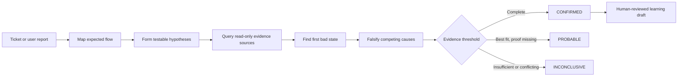

# Rooty

> Evidence-first root-cause investigation for AI coding agents.

[](https://nodejs.org/)
[](LICENSE)
[](https://www.npmjs.com/package/rooty-investigator)

Rooty gives Codex, Claude Code, Cursor, and other AI hosts a disciplined way to investigate incidents across source code, tickets, documentation, logs, traces, databases, and deployment history. It follows evidence to the earliest verified divergence, tests competing explanations, and reports a root cause only when the proof is strong enough.

Rooty investigates. It does **not** patch code, change data, mutate tickets, deploy, mitigate, or approve its own memory.


## Why Rooty exists

Most coding agents see only the repository. Production failures rarely live in only one place: the ticket describes the symptom, code describes the intended path, traces show the executed path, logs expose failures, database history reveals state, and deployments establish what changed.

Rooty connects those sources into one read-only investigation workflow:



## What you get

| Component | Purpose |
|---|---|
| Setup skill | Guides documentation-first project discovery and provider setup through the active AI agent |
| MCP builder skill | Researches and proposes read-only provider connections for Codex, Claude Code, and Cursor |
| Investigator skill | Provides a portable, versioned investigation method shared across AI hosts |
| Host adapters | Render reviewed MCP intent into host-specific project configuration |
| Deterministic safety engine | Validates paths, ownership, trusted recipes, credentials, and safe configuration merges |
| Doctor | Verifies installed skills, context, credentials, connectors, and harmless read probes |
| Evidence model | Separates `REPORTED`, `OBSERVED`, `INFERRED`, `HYPOTHESIS`, and `UNKNOWN` claims |
| Case artifacts | Produces a hash-chained evidence ledger, case state, and deterministic report for snapshot-backed cases |
| Learning workflow | Promotes only verified `CONFIRMED` cases through explicit human review and 180-day expiry |
| Evaluation suite | Replays 15 frozen cases, including abstention, prompt injection, and mutation attempts |

## Requirements

- Node.js 20 or newer
- Codex, Claude Code, or Cursor
- Read-only identities for the evidence providers Rooty will use
- Any provider runtime required by an approved MCP proposal
- Credentials supplied through environment variables, an approved secret manager, or host-managed OAuth

Rooty has no runtime npm dependencies and no gateway. Each host connects directly to the configured MCP providers.

## Install in a project

```console
npx rooty-investigator install
```

Then open the project in Codex, Cursor, or Claude and ask:

```text
Set up Rooty for this project.
```

The CLI copies Rooty's skills and creates `.rooty/config/project-context.json`. The active agent reviews documentation, performs targeted discovery, proposes provider access, requests approvals, guides credentials, and verifies readiness.

If you already know the documentation locations:

```console
npx rooty-investigator install --docs "README.md,docs,architecture"
```

## What installation creates

```text
.agents/skills/
├── rooty-setup/
├── rooty-mcp-builder/
└── root-cause-investigator/

.claude/skills/
├── rooty-setup/
├── rooty-mcp-builder/
└── root-cause-investigator/

.rooty/
├── install-manifest.json
└── project-context.json
```

Codex and Cursor discover `.agents/skills`; Claude uses `.claude/skills`. Installation is safe to repeat: Rooty updates unchanged owned skill files and refuses to overwrite modified or unowned ones.

## Documentation-first, not documentation-trusting

`.rooty/config/project-context.json` stores only user-confirmed documentation paths:

```json
{
  "schema_version": 1,
  "documentation": {
    "paths": ["README.md", "docs/"]
  }
}
```

Rooty reads relevant documents on demand to locate likely business flows, components, communication paths, source areas, data stores, telemetry, and identifiers. Documentation guides where Rooty looks; it does not prove how the system currently behaves.

Rooty does not generate or persist a project map, documentation index, embedding, inferred architecture, cached summary, or conclusion. Material findings are verified using current configuration, source, or runtime evidence.

## Try the offline demo

The demo uses synthetic evidence and the bundled read-only MCP server. It does not need production credentials.

```console
rooty init --host all --demo --project /path/to/sandbox-project
rooty run ROOTY-101 \
  --project /path/to/sandbox-project \
  --snapshot /path/to/Rooty/evals/mock-sources/confirmed-timeout.json \
  --case-dir /path/to/rooty-case-demo
rooty report --project /path/to/sandbox-project --case-dir /path/to/rooty-case-demo
```

`rooty run` is the MVP's deterministic **frozen-snapshot runner**. It is used for demonstrations, artifact generation, and evaluation; it does not orchestrate live provider calls.

## Agent-led setup

```text
install
  -> confirm documentation locations
  -> read relevant docs as navigation references
  -> inspect source/config only where needed
  -> identify data and observability providers
  -> propose exact read-only MCP access
  -> request host-native approval
  -> render host configuration
  -> show missing credential bindings
  -> verify tools and harmless probes
```

Data and observability are mandatory investigation capabilities. Ticketing is optional because the developer can paste a ticket. Documentation is never treated as guaranteed truth, and Rooty does not generate a persistent project map.

Every MCP entry declares all credential bindings, but never credential values. Rooty shows the exact host config path, each missing binding, why it is needed, and the smallest next action.

When setup reports data and observability as ready, ask:

```text
Investigate PAY-123. Root cause only.
Do not propose or apply fixes. Validate every assumption with current-case evidence.
```

See [Project and MCP setup](docs/setup.md) and [Investigating an incident](docs/investigation.md).

## Evidence and outcomes

Rooty never treats all statements equally:

| Classification | Meaning |
|---|---|
| `REPORTED` | A ticket, user, or attachment says it happened |
| `OBSERVED` | A cited source, query, trace, or history record directly shows it |
| `INFERRED` | A conclusion derived from observations, with references |
| `HYPOTHESIS` | A testable explanation with predicted evidence |
| `UNKNOWN` | Evidence is missing, inaccessible, expired, sampled, truncated, or contradictory |

`CONFIRMED` requires an established first bad state, distinct observed support for each material causal link, observed elimination of material alternatives, no critical gap, and either independent corroboration or a verified reproduction. Otherwise Rooty must downgrade to `PROBABLE` or `INCONCLUSIVE`.

## Memory and learning

Rooty learns reusable investigation shortcuts—not unreviewed conclusions or raw production data.

```console
rooty memory propose \
  --project /path/to/project \
  --case-dir /path/to/confirmed-case

rooty memory approve \
  --project /path/to/project \
  --case-dir /path/to/confirmed-case \
  --draft /path/to/project/.investigator/memory/drafts/INV-....json \
  --reviewed-by team-payments
```

Only a currently verified `CONFIRMED` case can become a draft. Approval re-verifies the source case and evidence hash chain, requires a human or accountable team, rejects sensitive fields, and sets an expiry. Approved memory may suggest pivots and hypotheses in a later case; it can never prove the new case.

Read [Memory and learning](docs/memory-and-learning.md) for lifecycle and governance details.

## Supported hosts and providers

| Provider | Capability | Current setup status |
|---|---|---|
| Microsoft SQL MCP Server through DAB | Data | Standard Rooty reference |
| Elastic standalone / Agent Builder | Observability | Standard Rooty reference; Elasticsearch 8.19.15 uses standalone Docker |
| Atlassian Rovo for Jira Cloud | Ticketing | Standard Rooty reference; optional capability |
| MongoDB official MCP server | Data | Agent reference; live tool review required |
| Grafana official MCP server | Observability | Agent reference; live tool review required |
| Azure DevOps official MCP server | Ticketing | Agent reference; live tool review required |
| Other official or custom server | Any | Custom review required |

Rooty supports project installation on Codex, Claude Code, and Cursor. Provider knowledge remains separate from host syntax so new providers do not require a provider-by-host implementation matrix. See [Architecture and integrations](docs/architecture.md).

## Safety model

Rooty uses defense in depth:

- Read-only agent instructions and host policies
- Explicit MCP tool allowlists
- HTTPS-only remote endpoints; unauthenticated access is loopback-only
- Credential names in files, credential values outside files
- Bounded log/trace windows, result limits, and `SELECT`-only demo database queries
- Case evidence stored outside the investigated source tree
- Append-only, hash-chained evidence ledgers
- Prompt-injection resistance for tickets, docs, logs, database text, memory, and connector output
- Human approval before reusable memory promotion

The provider identity, database role or replica, and infrastructure policy remain the real security boundary. Read [Security and threat model](docs/security.md) before connecting Rooty to production.

## MVP scope and current limits

- Rooty does not include a gateway; hosts connect directly to MCP servers.
- The setup agent discovers provider signals from confirmed documentation and targeted current project evidence; the developer approves material choices and external actions.
- The CLI does not install provider runtimes, pull containers, start OAuth, or persist credential values.
- Provider references for MongoDB, Grafana, and Azure DevOps require live official-documentation and tool-surface review before use.
- Live investigations are performed by the configured AI host using the installed skill and connectors.
- The CLI's persisted case/ledger/memory pipeline currently consumes frozen investigation snapshots; automatic capture of a live host conversation into that pipeline is not yet implemented.
- Rooty produces investigation findings only. Remediation belongs to a separate workflow and owner.

## Documentation

- [Documentation home](docs/README.md)
- [Getting started](docs/getting-started.md)
- [Project and MCP setup](docs/setup.md)
- [Investigating an incident](docs/investigation.md)
- [Evidence and reporting](docs/evidence-and-reporting.md)
- [Memory and learning](docs/memory-and-learning.md)
- [Architecture and integrations](docs/architecture.md)
- [Security and threat model](docs/security.md)
- [CLI reference](docs/cli-reference.md)
- [Troubleshooting](docs/troubleshooting.md)
- [Agent-led setup requirements](docs/automatic-mcp-setup-requirements.md)
- [Implementation plan](docs/automatic-mcp-setup-implementation-plan.md)

## Development

```console
npm test
npm run doctor
npm run eval
```

`npm run doctor` checks package health without requiring project connectors. In an agent-led installation, `rooty doctor --project ...` verifies installed skill ownership and documentation context alongside package safety checks.

The project uses only Node.js standard-library modules. The 15-case evaluation covers confirmed, probable, and inconclusive outcomes; evidence abstention; prompt injection; bounded source access; and blocked mutation attempts.

## License

[MIT](LICENSE) © 2026 Rooty contributors.
