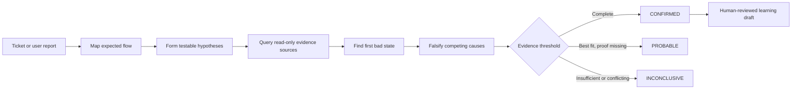

# Rooty

> Evidence-first root-cause investigation for AI coding agents.

[](https://nodejs.org/)
[](LICENSE)
[](https://www.npmjs.com/package/rooty-investigator)

Rooty gives Codex, Claude Code, Cursor, and other AI hosts a disciplined way to investigate incidents across source code, tickets, documentation, logs, traces, databases, and deployment history. It follows evidence to the earliest verified divergence, tests competing explanations, and reports a root cause only when the proof is strong enough.

Rooty investigates. It does **not** patch code, change data, mutate tickets, deploy, mitigate, or approve its own memory.


## Why Rooty exists

Most coding agents see only the repository. Production failures rarely live in only one place: the ticket describes the symptom, code describes the intended path, traces show the executed path, logs expose failures, database history reveals state, and deployments establish what changed.

Rooty connects those sources into one read-only investigation workflow:



## What you get

| Component | Purpose |
|---|---|
| Investigator skill | A portable, versioned investigation method shared across AI hosts |
| Source discovery | Detects likely ticketing, documentation, observability, database, and deployment providers from safe project files |
| Connector configuration | Converts validated provider choices, MCP URLs, and credential environment-variable names into a source registry |
| Host adapters | Generates read-only Codex, Claude Code, and Cursor configuration |
| Doctor | Verifies the kit, auth references, MCP negotiation, tool allowlists, and harmless live read probes |
| Evidence model | Separates `REPORTED`, `OBSERVED`, `INFERRED`, `HYPOTHESIS`, and `UNKNOWN` claims |
| Case artifacts | Produces a hash-chained evidence ledger, case state, and deterministic report for snapshot-backed cases |
| Learning workflow | Promotes only verified `CONFIRMED` cases through explicit human review and 180-day expiry |
| Evaluation suite | Replays 15 frozen cases, including abstention, prompt injection, and mutation attempts |

## Requirements

- Node.js 20 or newer
- An AI host: Codex, Claude Code, Cursor, or a host that can load the canonical skill
- Direct MCP endpoints for the evidence providers you want Rooty to use
- Provider identities and database roles that are read-only at the enforcement layer
- OAuth access tokens, bearer tokens, or an approved secret manager exposed through environment variables

Rooty has no runtime npm dependencies and no gateway in the MVP. Each host connects directly to the configured MCP endpoints.

## Install

```console
npm install --global rooty-investigator
rooty help
```

The compatibility command `investigator` is installed alongside `rooty`.

To work from the repository:

```console
git clone https://github.com/MahmoudElderby/Rooty.git
cd Rooty
npm test
npm run doctor
```

## Try the offline demo

The demo uses synthetic evidence and the bundled read-only MCP server. It does not need production credentials.

```console
rooty init --host all --demo --project /path/to/sandbox-project
rooty run ROOTY-101 \
  --project /path/to/sandbox-project \
  --snapshot /path/to/Rooty/evals/mock-sources/confirmed-timeout.json \
  --case-dir /path/to/rooty-case-demo
rooty report --project /path/to/sandbox-project --case-dir /path/to/rooty-case-demo
```

`rooty run` is the MVP's deterministic **frozen-snapshot runner**. It is used for demonstrations, artifact generation, and evaluation; it does not orchestrate live provider calls.

## Configure a real project

### 1. Discover likely evidence sources

```console
rooty sources discover --project /path/to/project
```

Rooty scans bounded, non-secret text files and writes `.investigator/discovery.json`. Repository detections remain `INFERRED`; review them before activation.

### 2. Configure direct MCP connectors

Supply the provider, MCP URL, and auth mode for each required capability:

```console
rooty sources configure --project /path/to/project \
  --ticketing-provider atlassian \
  --ticketing-mcp-url https://mcp.example.internal/atlassian \
  --ticketing-auth oauth \
  --documentation-provider atlassian \
  --documentation-mcp-url https://mcp.example.internal/atlassian \
  --documentation-auth oauth \
  --observability-provider datadog \
  --observability-mcp-url https://mcp.example.internal/observability \
  --observability-auth oauth \
  --database-provider postgres \
  --database-mcp-url https://mcp.example.internal/database \
  --database-auth oauth \
  --deployments-provider argocd \
  --deployments-mcp-url https://mcp.example.internal/deployments \
  --deployments-auth oauth
```

Rooty writes references such as `ROOTY_ATLASSIAN_MCP_OAUTH_TOKEN`; it never writes token values. Complete setup details, bearer-token examples, and supported recipes are in the [setup guide](docs/setup.md).

### 3. Make credentials available

Obtain tokens through each provider's approved flow, then expose them to the AI host process:

```console
export ROOTY_ATLASSIAN_MCP_OAUTH_TOKEN="..."
export ROOTY_DATADOG_MCP_OAUTH_TOKEN="..."
export ROOTY_POSTGRES_MCP_OAUTH_TOKEN="..."
export ROOTY_ARGOCD_MCP_OAUTH_TOKEN="..."
```

On PowerShell, use `$env:VARIABLE_NAME = "..."`. Do not place values in `.investigator/sources.json`, host configuration, or Git.

### 4. Install the host adapter and activate connectors

```console
rooty init --host codex --project /path/to/project --activate-connectors
```

Use `claude`, `cursor`, or `all` instead of `codex` when appropriate. Rooty refuses to overwrite existing host files; review or merge existing configuration first.

### 5. Verify readiness

```console
rooty doctor --project /path/to/project
```

A healthy result means all five capabilities are configured and activated, credential references are available, every MCP server initializes, allowed tools resolve, and every harmless read probe succeeds.

### 6. Investigate from your AI host

Open the configured project in the host and ask:

```text
Investigate PAY-123. Root cause only.
Do not propose or apply fixes. Validate every assumption with current-case evidence.
```

Rooty will extract missing pivots, map the relevant request/data path, query the narrowest useful evidence, identify the first bad state, test alternatives, and return `CONFIRMED`, `PROBABLE`, or `INCONCLUSIVE` with evidence references and explicit gaps.

See [Investigating an incident](docs/investigation.md) for the full end-user and internal journey.

## Evidence and outcomes

Rooty never treats all statements equally:

| Classification | Meaning |
|---|---|
| `REPORTED` | A ticket, user, or attachment says it happened |
| `OBSERVED` | A cited source, query, trace, or history record directly shows it |
| `INFERRED` | A conclusion derived from observations, with references |
| `HYPOTHESIS` | A testable explanation with predicted evidence |
| `UNKNOWN` | Evidence is missing, inaccessible, expired, sampled, truncated, or contradictory |

`CONFIRMED` requires an established first bad state, distinct observed support for each material causal link, observed elimination of material alternatives, no critical gap, and either independent corroboration or a verified reproduction. Otherwise Rooty must downgrade to `PROBABLE` or `INCONCLUSIVE`.

## Memory and learning

Rooty learns reusable investigation shortcuts—not unreviewed conclusions or raw production data.

```console
rooty memory propose \
  --project /path/to/project \
  --case-dir /path/to/confirmed-case

rooty memory approve \
  --project /path/to/project \
  --case-dir /path/to/confirmed-case \
  --draft /path/to/project/.investigator/memory/drafts/INV-....json \
  --reviewed-by team-payments
```

Only a currently verified `CONFIRMED` case can become a draft. Approval re-verifies the source case and evidence hash chain, requires a human or accountable team, rejects sensitive fields, and sets an expiry. Approved memory may suggest pivots and hypotheses in a later case; it can never prove the new case.

Read [Memory and learning](docs/memory-and-learning.md) for lifecycle and governance details.

## Supported hosts and provider recipes

| Area | Included in the MVP |
|---|---|
| Hosts | Codex, Claude Code, Cursor, and a generic skill-based integration path |
| Ticketing/docs | Atlassian recipes |
| Observability | Datadog, Grafana, Sentry recipes |
| Databases | PostgreSQL and MySQL read-only recipes |
| Deployments | Argo CD and Kubernetes recipes |
| Demo | Bundled synthetic snapshot provider |

A recipe defines expected capabilities, allowed read tools, auth references, and a doctor probe. It does not install a third-party MCP server or make a provider account read-only. See [Architecture and integrations](docs/architecture.md).

## Safety model

Rooty uses defense in depth:

- Read-only agent instructions and host policies
- Explicit MCP tool allowlists
- HTTPS-only remote endpoints; unauthenticated access is loopback-only
- Credential names in files, credential values outside files
- Bounded log/trace windows, result limits, and `SELECT`-only demo database queries
- Case evidence stored outside the investigated source tree
- Append-only, hash-chained evidence ledgers
- Prompt-injection resistance for tickets, docs, logs, database text, memory, and connector output
- Human approval before reusable memory promotion

The provider identity, database role or replica, and infrastructure policy remain the real security boundary. Read [Security and threat model](docs/security.md) before connecting Rooty to production.

## MVP scope and current limits

- Rooty does not include a gateway; hosts connect directly to MCP servers.
- Rooty discovers provider signals, but a human must validate mappings and provide MCP URLs and auth references.
- Rooty does not implement provider OAuth browser flows or persist credentials.
- Live investigations are performed by the configured AI host using the installed skill and connectors.
- The CLI's persisted case/ledger/memory pipeline currently consumes frozen investigation snapshots; automatic capture of a live host conversation into that pipeline is not yet implemented.
- Rooty produces investigation findings only. Remediation belongs to a separate workflow and owner.

## Documentation

- [Documentation home](docs/README.md)
- [Getting started](docs/getting-started.md)
- [Project and connector setup](docs/setup.md)
- [Investigating an incident](docs/investigation.md)
- [Evidence and reporting](docs/evidence-and-reporting.md)
- [Memory and learning](docs/memory-and-learning.md)
- [Architecture and integrations](docs/architecture.md)
- [Security and threat model](docs/security.md)
- [CLI reference](docs/cli-reference.md)
- [Troubleshooting](docs/troubleshooting.md)

## Development

```console
npm test
npm run doctor
npm run eval
```

`npm run doctor` checks package health without requiring project connectors. A normal `rooty doctor --project ...` is the strict production-readiness gate.

The project uses only Node.js standard-library modules. The 15-case evaluation covers confirmed, probable, and inconclusive outcomes; evidence abstention; prompt injection; bounded source access; and blocked mutation attempts.

## License

[MIT](LICENSE) © 2026 Rooty contributors.
