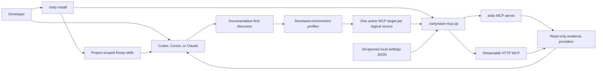
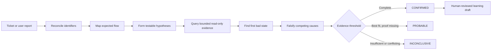

# Rooty

> Evidence-first production investigation and log-storage review for Codex, Claude Code, and Cursor.

[](https://nodejs.org/)
[](https://www.npmjs.com/package/rooty-investigator)
[](LICENSE)

Rooty helps an AI coding agent investigate production incidents across source code, documentation, tickets, logs, traces, databases, and deployment history. It also reviews provider-backed or file-based log storage to rank repeated calls, payload volume, and daily growth across a whole store or a named service, API, response, or log family.

Rooty investigates and reviews. It does **not** patch code, change data, mutate tickets, deploy, mitigate, or approve its own reusable memory.


Watch the full walkthroughs: [installation](media/rooty-install.mp4), [investigation](media/rooty-investigation.mp4), or [both acts](media/rooty-how-it-works.mp4).

## Quick start

### 1. Install Rooty in the project

```console
npx rooty-investigator install
```

Rooty detects Codex, Cursor, and Claude project markers. You can also select hosts explicitly:

```console
npx rooty-investigator install --cursor
npx rooty-investigator install --codex --claude
```

If the project documentation entry point is already known:

```console
npx rooty-investigator install --docs "README.md,docs"
```

### 2. Ask the active agent to finish setup

Open the project in an installed host and ask:

```text
Set up Rooty for this project.
```

The setup agent confirms documentation paths and environments, performs bounded project discovery, identifies required evidence providers, proposes read-only MCP access, and shows every write or external action before it happens.

### 3. Supply local MCP settings

Rooty creates a Git-ignored local settings file at:

```text
.rooty/config/mcp-settings.local.json
```

Initialize the keys requested by setup:

```console
npx rooty-investigator settings init --keys prod.provider.url,prod.provider.token
```

Populate a private JSON file outside the repository, then copy it into Rooty without placing values in shell arguments:

```console
npx rooty-investigator settings configure --file /private/path/rooty-settings.json
npx rooty-investigator settings status
```

`settings status` prints setting paths and `AVAILABLE` or `MISSING`. It never prints values.

### 4. Verify readiness

```console
npx rooty-investigator doctor
```

Doctor reports three independent states:

```text
PACKAGE_READY
PROJECT_CONFIGURED
INVESTIGATION_READY
```

When project configuration and bounded live reads are ready, ask the agent to investigate:

```text
Investigate PAY-123. Root cause only.
Do not propose or apply fixes. Validate every assumption with current-case evidence.
```

Or ask which logs consume storage and what to reduce first:

```text
Use $log-storage-review to review this log store. Report the repeated-call, payload-size, and daily-growth rankings. Do not make changes.
```

## How Rooty is organized

Rooty has no hosted gateway or central credential store. The installed AI host runs a project-local launcher that reads only declared local settings, then starts a reviewed stdio MCP server or bridges stdio to a reviewed Streamable HTTP endpoint.



The deterministic CLI owns paths, schemas, installation fingerprints, safe host merges, environment switching, setting-key validation, and readiness checks. The agent owns semantic discovery, provider research, proposals, approvals, and live investigation reasoning.

## What installation creates

```text
.agents/skills/                         # Codex and Cursor
├── rooty-setup/
├── rooty-mcp-builder/
├── root-cause-investigator/
└── log-storage-review/

.claude/skills/                         # Claude Code
├── rooty-setup/
├── rooty-mcp-builder/
├── root-cause-investigator/
└── log-storage-review/

.rooty/
├── start-mcp.cjs                       # managed settings-backed launcher
├── config/
│   ├── project-context.json            # confirmed documentation paths only
│   ├── environment-profiles.json       # reviewed switchable targets, after setup
│   └── mcp-settings.local.json         # local values, always Git-ignored
├── state/
│   ├── install-manifest.json           # SHA-256 ownership fingerprints
│   ├── setup-progress.json              # resumable setup state, Git-ignored
│   └── active-environments.json         # active target per host, Git-ignored
└── memory/
    ├── drafts/                          # Git-ignored
    └── approved/                        # sanitized, human-reviewed learning
```

Provider artifacts are created only after approval under `.rooty/mcp/<category>/<provider>/`.

Installation is safe to repeat. Rooty updates unchanged files it owns and refuses to overwrite modified or unowned files. Narrowing the host selection stops tracking the other host files without deleting them.

## Local MCP settings

New local settings documents use schema version 2 and group values by environment:

```json
{
  "schema_version": 2,
  "settings": {
    "prod": {
      "provider": {
        "url": "",
        "token": ""
      }
    }
  }
}
```

An empty string is `MISSING`. Rooty accepts only nested objects with string leaves and validates every dot-separated setting path before activation. Existing flat schema-version-1 documents remain supported.

The settings contract is deliberately strict:

- Within Rooty-managed project state, values exist only in `.rooty/config/mcp-settings.local.json`; interactive host OAuth remains a separate flow.
- The local settings file is always added to `.gitignore` and restricted to the current user where file modes are supported.
- Host MCP files contain the launcher path, settings path, setting-path names, and value-free templates—never resolved values.
- Managed profiles cannot forward values through host `env`, `env_vars`, headers, or machine environment interpolation.
- The launcher reads only the keys declared by the selected environment target.
- CLI status, doctor output, plans, errors, and JSON output never print setting values.

Treat the local settings JSON as a secret store: protect it, back it up only through an approved secret-management process, and never commit or paste it into chat.

### Mapping a setting to a child-process key

Some MCP servers require a fixed child environment name. Rooty keeps environment-specific keys in JSON and maps the selected value only inside the child process:

```text
--keys preprod.sql.server=ROOTY_SQL_PREPROD_SERVER,preprod.sql.options=ROOTY_SQL_PREPROD_OPTIONS,preprod.sql.catalogs.orders.mcp_url=ASPNETCORE_URLS
```

This lets production and preprod coexist in the local settings JSON without depending on machine-level environment variables.

## Host MCP configuration

Rooty maintains one active rendering for each logical source. The rendered name always identifies the selected environment, such as `rooty-prod-sql-orders` or `rooty-preprod-sql-orders`.

### Cursor and Claude JSON

Cursor uses `.cursor/mcp.json`; Claude uses project `.mcp.json`. A settings-backed HTTP provider is exposed to either host as stdio through the Rooty bridge:

```json
{
  "mcpServers": {
    "rooty-preprod-orders": {
      "type": "stdio",
      "command": "C:/Program Files/nodejs/node.exe",
      "args": [
        "C:/project/.rooty/start-mcp.cjs",
        "--settings",
        "C:/project/.rooty/config/mcp-settings.local.json",
        "--keys",
        "preprod.orders.url,preprod.orders.token",
        "--url",
        "${preprod.orders.url}",
        "--header",
        "Authorization: Bearer ${preprod.orders.token}"
      ]
    }
  }
}
```

### Codex TOML

Codex uses trusted-project `.codex/config.toml`:

```toml
[mcp_servers."rooty-preprod-orders"]
type = "stdio"
command = "C:/Program Files/nodejs/node.exe"
args = [
  "C:/project/.rooty/start-mcp.cjs",
  "--settings",
  "C:/project/.rooty/config/mcp-settings.local.json",
  "--keys",
  "preprod.orders.url,preprod.orders.token",
  "--url",
  "${preprod.orders.url}",
  "--header",
  "Authorization: Bearer ${preprod.orders.token}"
]
enabled = true
required = true
enabled_tools = ["verified_read_tool"]
default_tools_approval_mode = "prompt"
```

Rooty preserves unrelated MCP entries and refuses malformed or ambiguous host files. The setup proposal shows the exact merge before it is applied.

Interactive host-managed OAuth remains a separate supported path when a provider requires it. Rooty does not store OAuth refresh tokens.

## Documentation-first setup

`.rooty/config/project-context.json` stores only the developer-confirmed documentation decision and path strings:

```json
{
  "schema_version": 2,
  "documentation": {
    "status": "confirmed_paths",
    "paths": ["README.md", "docs/"]
  }
}
```

Change the documentation entry point with:

```console
npx rooty-investigator context set-docs --paths knowledge
```

Rooty recommends `knowledge/` when that folder exists. You can explicitly confirm that no documentation entry point exists with `context set-docs --none`.

Documentation tells Rooty where to look. It never proves current architecture or an incident conclusion. Rooty does not persist a generated project map, documentation index, embedding, inferred architecture, cached summary, or investigation conclusion.

If setup is skipped or cancelled, Rooty saves only the current stage, confirmed selections, active host, and next action. It does not save prompt transcripts, discovered content, inferred architecture, or values.

```console
npx rooty-investigator setup status
```

The next setup request resumes from the recorded stage.

## Environment discovery and switching

Setup performs bounded environment discovery across safe documentation and configuration evidence, then asks the developer to confirm which environments are real, which to configure, and which should start active.

Inspect unconfirmed candidates directly with:

```console
npx rooty-investigator env discover --json
```

Approved environment profiles keep stable logical sources with reviewed production, preprod, staging, or other targets. Only one target for each logical source appears in a host file.

Preview and apply a switch:

```console
npx rooty-investigator env plan preprod
npx rooty-investigator env use preprod
```

The host is inferred from existing Rooty configuration, setup state, or a single installed host. Use `--host cursor` only when several configured hosts make the choice ambiguous. Use `--all-hosts` only when every configured host should switch atomically.

You can ask the installed agent for the same operation:

```text
Switch Rooty to preprod.
```

The agent runs the deterministic plan, shows removed and added environment-visible MCP names, requests approval, applies the switch, asks for a host reload, and reruns doctor. Production and preprod names for the same logical MCP are never left active together.

## Readiness with doctor

```console
npx rooty-investigator doctor
npx rooty-investigator doctor --environment preprod
npx rooty-investigator doctor --json
```

| State | What it proves |
|---|---|
| `PACKAGE_READY` | The installed CLI, Node version, skills, recipes, bundled tools, and replay suite are healthy |
| `PROJECT_CONFIGURED` | Rooty is installed, local state is safe, environment profiles exist, provider artifacts exist, and active host entries match the selected targets |
| `INVESTIGATION_READY` | Required local setting values resolve, MCP servers initialize, advertised tools exactly match reviewed allowlists, and bounded environment-identity reads succeed |

Doctor names missing host configuration, launcher/artifact problems, undeclared or empty setting keys, tool-surface drift, and failed bounded reads without exposing values.

Use package-only health checks in CI or development:

```console
npm run doctor
```

## Investigation workflow

Rooty follows evidence rather than the first plausible explanation:



Rooty classifies every material statement:

| Classification | Meaning |
|---|---|
| `REPORTED` | A ticket, user, or attachment says it happened |
| `OBSERVED` | A cited source, query, trace, or history record directly shows it |
| `INFERRED` | A conclusion derived from observations, with references |
| `HYPOTHESIS` | A testable explanation with predicted evidence |
| `UNKNOWN` | Evidence is missing, inaccessible, expired, sampled, truncated, or contradictory |

`CONFIRMED` requires an established first bad state, observed support for every material causal link, elimination of material alternatives, no critical evidence gap, and independent corroboration or verified reproduction. Rooty downgrades to `PROBABLE` or `INCONCLUSIVE` when that standard is not met.

Read [Investigating an incident](docs/investigation.md) and [Evidence and reporting](docs/evidence-and-reporting.md) for the complete method.

## Supported hosts and provider references

Project installation currently supports:

- Codex
- Cursor
- Claude Code

Provider knowledge is separate from host syntax, so one reviewed provider design can render consistently across supported hosts.

| Provider | Capability | Current Rooty reference |
|---|---|---|
| Microsoft SQL MCP Server through DAB | Data | One isolated, explicit-entity, read-only MCP per live environment/catalog |
| Elasticsearch standalone / Agent Builder | Observability | Elasticsearch 8.19.15 compatibility through the official standalone image; newer deployments require current Agent Builder review |
| Atlassian Rovo for Jira Cloud | Ticketing | Optional ticketing reference with identity and tool-surface review |
| MongoDB official MCP server | Data | Official-server reference; live read-only controls and tool review required |
| Grafana official MCP server | Observability | Official-server reference; live viewer access and tool review required |
| Azure DevOps official MCP server | Ticketing | Official-server reference; live scope and tool review required |
| Other official or custom server | Any | Starts as `REVIEW_REQUIRED` |

Data and observability are mandatory investigation capabilities. Ticketing is optional because a developer can paste ticket content.

## Security model

Connecting an AI agent to production evidence is privileged. Rooty is one layer in a defense-in-depth design.

- Use dedicated provider-side read-only identities, roles, replicas, scopes, and network controls.
- Keep `.rooty/config/mcp-settings.local.json` Git-ignored and protected as a local secret file.
- Keep values out of environment profiles, host MCP files, command arguments, plans, logs, doctor output, and chat.
- Require HTTPS for remote endpoints; unauthenticated MCP is loopback-only.
- Require explicit read-tool allowlists and fail closed when live tools are missing or unexpected.
- Bound time windows, row counts, result sizes, and query cost.
- Store case evidence outside the investigated source tree.
- Treat tickets, documentation, logs, traces, database text, connector output, and prior memory as untrusted evidence—not instructions.
- Require human review before reusable learning is approved.

MCP annotations and host allowlists are useful controls, but provider permissions remain the real authorization boundary. Read the full [Security and threat model](docs/security.md) before connecting Rooty to production.

## Memory and learning

Rooty learns reusable investigation shortcuts, not unreviewed conclusions or raw production evidence.

```console
rooty memory propose \
  --project /path/to/project \
  --case-dir /path/to/confirmed-case

rooty memory approve \
  --project /path/to/project \
  --case-dir /path/to/confirmed-case \
  --draft /path/to/project/.rooty/memory/drafts/INV-....json \
  --reviewed-by team-payments
```

Only a currently verified `CONFIRMED` case can become a draft. Approval re-verifies the evidence hash chain, requires an accountable reviewer, rejects sensitive fields, and assigns an expiry. Approved memory can suggest later pivots and hypotheses; it can never prove a new case.

Read [Memory and learning](docs/memory-and-learning.md) for lifecycle and governance details.

## Offline demo and deterministic artifacts

The bundled snapshot uses synthetic evidence and requires no production access:

```console
rooty init --host all --demo --project /path/to/sandbox-project
rooty run ROOTY-101 \
  --project /path/to/sandbox-project \
  --snapshot /path/to/Rooty/evals/mock-sources/confirmed-timeout.json \
  --case-dir /path/to/rooty-case-demo
rooty report \
  --project /path/to/sandbox-project \
  --case-dir /path/to/rooty-case-demo
```

This frozen-snapshot pipeline creates deterministic case state, a hash-chained evidence ledger, and a report. It is used for demonstrations, regression tests, and evaluation. Live investigations are performed by the configured AI host; automatic capture of a live host conversation into the persisted case pipeline is not yet implemented.

## Current boundaries

- Rooty has no hosted gateway or central credential service.
- Rooty installs project skills and its local launcher; it does not silently install provider runtimes, pull containers, or start OAuth.
- The setup agent discovers provider signals from confirmed documentation and targeted safe project evidence; developers approve material choices and external actions.
- Non-standard and version-dependent providers remain `REVIEW_REQUIRED` until current official documentation, read-only controls, and live tools are verified.
- Live investigations run through the configured AI host and MCP connections.
- Rooty reports investigation findings only. Remediation belongs to a separate workflow and accountable owner.

## Command map

| Goal | Command |
|---|---|
| Install project skills | `rooty install` |
| Show confirmed documentation | `rooty context show` |
| Update documentation paths | `rooty context set-docs --paths knowledge` |
| Inspect resumable setup | `rooty setup status` |
| Discover environment candidates | `rooty env discover --json` |
| List configured environments | `rooty env list` |
| Preview an environment switch | `rooty env plan preprod` |
| Apply an environment switch | `rooty env use preprod` |
| Initialize local setting paths | `rooty settings init --keys prod.provider.url,prod.provider.token` |
| Copy a private settings document | `rooty settings configure --file FILE` |
| Check setting availability | `rooty settings status` |
| Check package, project, and live readiness | `rooty doctor` |
| Print the CLI version | `rooty --version` or `rooty -V` |
| Run the frozen-snapshot pipeline | `rooty run TICKET --snapshot FILE --case-dir PATH` |
| Render an existing case report | `rooty report --case-dir PATH` |

See the complete [CLI reference](docs/cli-reference.md), including compatibility commands for earlier source-registry workflows.

## Documentation

- [Documentation home](docs/README.md)
- [Getting started](docs/getting-started.md)
- [Project and MCP setup](docs/setup.md)
- [Investigating an incident](docs/investigation.md)
- [Evidence and reporting](docs/evidence-and-reporting.md)
- [Memory and learning](docs/memory-and-learning.md)
- [Architecture and integrations](docs/architecture.md)
- [Security and threat model](docs/security.md)
- [CLI reference](docs/cli-reference.md)
- [Troubleshooting](docs/troubleshooting.md)
- [Agent-led setup requirements](docs/automatic-mcp-setup-requirements.md)

## Development

```console
npm test
npm run doctor
npm run eval
```

Rooty uses only Node.js standard-library modules at runtime. The evaluation suite replays 15 independent frozen cases covering confirmed, probable, and inconclusive outcomes; evidence abstention; prompt injection; bounded source access; and blocked mutation attempts.

The explainer media is generated from captured CLI output with `node tools/video/generate.mjs`; see [`tools/video/README.md`](tools/video/README.md). The pipeline requires `ffmpeg` and Chrome, adds no package runtime dependencies, and is excluded from the npm tarball.

## License

[MIT](LICENSE) © 2026 Rooty contributors.
