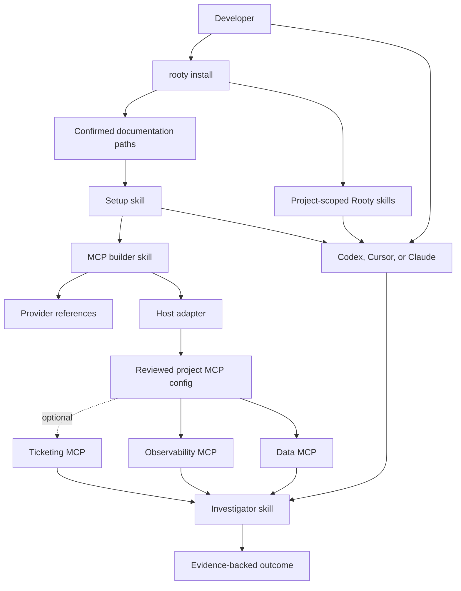

# Architecture and integrations

Rooty is a portable investigation kit, not a hosted service. Its product method remains evidence-first root-cause investigation; the setup implementation is split between a small deterministic CLI and specialized agent skills.

## System view



There is no Rooty gateway or central credential store. Each host invokes the project-local Rooty launcher, which resolves only declared values from a Git-ignored local JSON before connecting to the reviewed MCP server.

## Mechanical installer

`src/lib/installer.js` performs only deterministic project setup:

- validates the project and target paths;
- refuses filesystem roots and symlinked installation targets;
- resolves the target hosts from explicit flags, then the previous install, then project markers, then all hosts;
- copies `rooty-setup`, `rooty-mcp-builder`, and `root-cause-investigator` into `.agents/skills/` for Cursor and Codex and `.claude/skills/` for Claude, writing only the selected hosts and recording them in the manifest;
- records SHA-256 ownership fingerprints in `.rooty/state/install-manifest.json`;
- stores only confirmed documentation paths in `.rooty/config/project-context.json`;
- installs `.rooty/start-mcp.cjs` and initializes the Git-ignored `.rooty/config/mcp-settings.local.json` without overwriting existing values;
- creates `.rooty/memory/{drafts,approved}`, gitignores drafts, and copies non-conflicting legacy `.investigator/memory` cards without deleting the originals;
- leaves `.rooty/mcp/` to the setup agent, which creates `<category>/<provider>/` on first approved write; approved environment-specific SQL setup uses `.rooty/mcp/data/sql-server/<environment>/<domain>/dab-config.json` and one shared `.rooty/start-dab.cjs` launcher;
- removes the empty `.rooty/mcp` category folders created by earlier versions and reports skill files left behind by a narrowed host list without deleting them;
- migrates the two flat version 0.2.0 state files during reinstall;
- updates unchanged Rooty-owned files and refuses modified/unowned conflicts.

It does not discover providers, inspect source, execute provider packages, install runtimes, start OAuth, collect credentials, or render MCP configuration.

## Agent skills

### Setup skill

`skill/rooty-setup/` owns the developer journey. It reads confirmed documentation first, uses it as a navigation reference, verifies material choices against current safe project evidence, and asks only unresolved questions that affect provider, environment, exposure, credentials, or safety.

### MCP builder skill

`skill/rooty-mcp-builder/` separates provider knowledge from host syntax:

```text
references/
├── hosts/{codex,cursor,claude}.md
└── providers/
    ├── data/{sql-server,mongodb}.md
    ├── observability/{elasticsearch,grafana}.md
    ├── ticketing/{jira,azure-devops}.md
    └── custom/custom-provider.md
```

It researches official setup, creates a reviewable proposal, requests native approvals, declares local JSON setting keys in host configuration, and verifies a harmless read.

SQL Server has one deliberate cross-host runtime contract: one stable logical server per catalog and one active `rooty-{environment}-sql-{domain}` process. Codex, Cursor, and Claude all call the same hardened launcher with absolute paths; the launcher sets DAB's CWD to the isolated environment/catalog folder and starts only the read-only MCP tool surface. This avoids provider-by-host divergence, makes the active environment visible, and keeps catalog failures independent without duplicate logical servers.

### Investigator skill

`skill/root-cause-investigator/` retains Rooty's investigation method: pre-query evidence mapping, reported-identifier reconciliation, expected-flow reconstruction, failure-surface enumeration, wrapper-to-origin tracing, testable hypotheses, bounded evidence queries, first-bad-state analysis, competing-cause falsification, and `CONFIRMED`, `PROBABLE`, or `INCONCLUSIVE` outcomes. Confirmed project docs orient the search but never prove a claim. Universal methodology remains in this canonical skill rather than duplicated in always-on host rules.

## Deterministic safety engine

The existing CLI modules remain responsible for controls that should not depend on model judgment:

- path, secret, schema, and ownership validation;
- trusted recipe checks and explicit tool allowlists;
- safe host rendering and connector activation for compatibility workflows;
- MCP initialization, tool comparison, and harmless probes;
- frozen snapshot cases, hash-chained evidence, reports, memory review, and evaluation.

Approved project memory uses schema-versioned cards with stable concern keys and reusable-content fingerprints. Host adapters do not own or merge learning content.

The next engine contract will accept a canonical agent-authored provider proposal, validate it, and render a minimal host merge. Until that contract is implemented, non-standard provider configuration remains `REVIEW_REQUIRED` and is applied through the host's visible approval flow.

## Credentials

Every active-host MCP entry declares all required JSON setting keys and invokes `.rooty/start-mcp.cjs`. Values belong only in `.rooty/config/mcp-settings.local.json`, never in committed state, host files, profiles, proposals, logs, or chat. Host-managed OAuth remains separate when a provider requires interactive authorization.

Provider-side read-only identities are the security boundary. Server read-only modes and host tool allowlists provide additional layers.

## Frozen snapshot pipeline

`rooty run <ticket> --snapshot FILE` remains a separate deterministic path for examples, evidence ledgers, reports, memory governance, and evaluations. It does not orchestrate live provider calls. Live investigations run in the configured AI host.

## Extension principles

- Add provider knowledge under one capability category; do not duplicate it per host.
- Add host syntax once; do not encode provider behavior in host adapters.
- Prefer official vendor servers and current official documentation.
- Require provider-side least privilege, explicit read tool controls, and a harmless probe.
- Mark unknown or version-dependent behavior `REVIEW_REQUIRED`.
- Never persist a generated project map or use documentation as current-case proof.
- Never let connector content or memory override Rooty's instructions.
