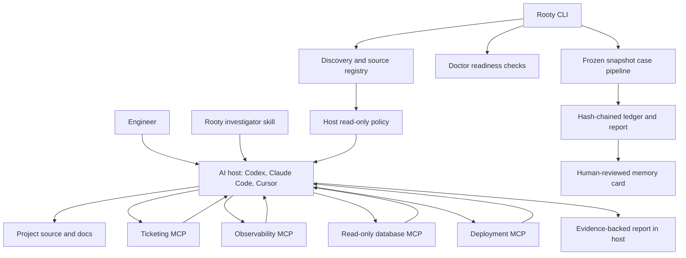

# Architecture and integrations

Rooty is a portable investigation kit, not a hosted service. It combines a canonical agent skill, a local setup/case CLI, direct MCP connector configuration, host-specific policy, an evidence model, reviewed memory, and deterministic evaluation.

## System view



There is no Rooty gateway in the MVP. The host talks directly to configured MCP servers. Rooty does not proxy provider data or hold a central credential store.

## Components

### Canonical investigator skill

`skill/root-cause-investigator/` is the portable behavioral contract. It defines:

- Investigation-only scope
- Read-only boundaries
- Evidence classifications
- Intake and hypothesis workflow
- First-bad-state and falsification method
- Confirmation stopping rules
- Report shape
- Memory governance

The same source is installed into host-specific locations so the investigation method remains consistent.

### Setup and case CLI

The dependency-free Node.js CLI handles:

- Safe repository discovery
- Source registry generation
- Host configuration rendering
- Connector activation manifests
- Package and project doctor checks
- Frozen snapshot case generation
- Evidence appends and report rendering
- Memory proposal and approval
- Evaluation replay

The CLI does not select or call an AI model.

### Connector recipes

`setup/connector-recipes/catalog.json` maps a provider to:

- One or more evidence capabilities
- Expected authentication metadata
- Credential environment-variable references
- Required read-only access
- Explicit allowed tools
- A bounded harmless doctor probe per capability

The recipe is an allowlist and setup contract. The provider's MCP server defines its actual wire behavior, and the provider identity defines its actual authorization.

### Source registry

`.investigator/sources.json` is the reviewed logical map between the project and its evidence providers. It contains public endpoints and credential **names**, not values.

`.investigator/activated-connectors.json` records only entries rendered into a host by `rooty init --activate-connectors`. Doctor uses that activation manifest to test what the host is expected to use.

### Host adapters

#### Codex

Rooty installs the canonical skill and creates project-scoped `.codex/config.toml` with:

- `sandbox_mode = "read-only"`
- `approval_policy = "untrusted"`
- Direct MCP definitions
- Explicit `enabled_tools`
- Required connectors

#### Claude Code

Rooty installs the skill and creates:

- `.mcp.json` with direct HTTP or demo stdio servers
- `.claude/settings.json` denying edit, write, notebook-edit, and shell tools
- A deterministic `PreToolUse` allowlist hook
- `.claude/rooty-allowed-tools.json`

#### Cursor

Rooty creates:

- `.cursor/mcp.json`
- `.cursor/rules/root-cause-investigator.mdc`

#### Generic host

Load the canonical `SKILL.md`, expose only recipe-allowed read tools, run with read-only filesystem access, and keep evidence outside the source tree. Tool annotations alone are not enforcement.

### Doctor

Strict doctor validates four layers:

1. **Static package:** skill presence, safe connector recipes, bundled read-tool annotations, evaluation fixtures, and the packaged project-ignore template.
2. **Project registry:** all required production capabilities are ready.
3. **Activation:** all required capabilities were rendered into the host.
4. **Live connector:** credential reference is available, endpoint initializes over MCP, negotiated protocol is used on later requests, tools list resolves the allowlist, and the bounded read probe succeeds.

`--package-only` checks layer 1 and downgrades missing project registry/activation to warnings. Strict mode additionally validates the investigated project's own `.gitignore`.

### Frozen snapshot case pipeline

`rooty run <ticket> --snapshot FILE` validates a captured investigation snapshot, computes an outcome, creates a case manifest, writes a hash-chained ledger, and renders a deterministic report.

This path provides reproducible examples and governance primitives. It is separate from the live host-driven investigation path in the current MVP.

### Memory

A confirmed snapshot-backed case may produce a sanitized draft. Approval re-verifies the case, assessment, ledger, schema, and fingerprints and requires an accountable reviewer. Approved cards expire after 180 days and remain advisory.

### Evaluation

The replay suite uses independent frozen inputs. Expected labels do not generate or appear in the case inputs. The suite checks:

- `CONFIRMED`, `PROBABLE`, and `INCONCLUSIVE` decisions
- Evidence abstention and critical gaps
- Independent corroboration and verified reproduction
- Prompt injection in untrusted evidence
- Deterministic mutation blocking

## Bundled demo MCP tools

The synthetic stdio server exposes six tools:

| Tool | Purpose | Key bound |
|---|---|---|
| `ticket_get` | Read one exact ticket | Ticket ID and case ID |
| `docs_search` | Search frozen docs | Maximum 50 results |
| `logs_search` | Search frozen logs | Maximum 24-hour UTC range and 1,000 results |
| `traces_search` | Search frozen traces | Maximum 24-hour UTC range and 1,000 results |
| `db_query_readonly` | Query frozen database rows | Single `SELECT`, maximum 500 rows |
| `deployments_list` | Read frozen deployment history | Service and maximum 24-hour UTC range |

Every tool requires an investigation case ID, advertises read-only annotations, reports source identity and coverage, and rejects unexpected arguments.

Real connectors may use different provider tool names. Their recipe allowlist and probe must match the server.

## Package layout

```text
Rooty/
├── bin/                         # Executable entry point
├── docs/                        # Product and operator documentation
├── evals/                       # Frozen cases and synthetic providers
├── hosts/                       # Host adapters and policy assets
├── memory/schema/               # JSON schemas for case and evidence artifacts
├── setup/
│   ├── connector-recipes/       # Provider allowlists and doctor probes
│   ├── discovery-rules/         # Safe repository signal rules
│   ├── doctor-checks/           # Doctor design notes
│   └── host-renderers/          # Renderer design notes
├── skill/root-cause-investigator/
│   ├── SKILL.md                 # Canonical agent behavior
│   ├── references/              # Workflow, evidence, registry, and report rules
│   └── scripts/                 # Portable ledger/report utilities
├── src/
│   ├── cli.js                   # Command routing
│   ├── mock-mcp-server.js       # Synthetic stdio MCP server
│   └── lib/                     # Core implementation
└── tests/                       # End-to-end MVP tests
```

## Extension principles

When adding a host or provider:

- Keep the canonical investigation method host-neutral.
- Add stricter host enforcement where the host supports it.
- Allowlist individual read tools, not an entire server by default.
- Require provider-level least privilege.
- Add one harmless bounded probe per capability.
- Preserve source identity, event time, pagination, truncation, and sampling metadata.
- Test failures as carefully as successes.
- Never allow a connector or memory result to override Rooty's instructions.
