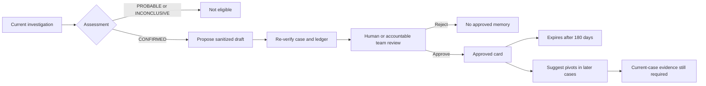

# Memory and learning

Rooty's memory is a reviewed library of reusable investigation shortcuts. It stores sanitized symptom signatures, root-cause classes, useful pivots, query recipes, and validated versions. It does not store raw logs, customer payloads, credentials, or an automatically trusted answer.

## Learning lifecycle



## Propose a learning card

Only a currently verified `CONFIRMED` snapshot-backed case is eligible:

```console
rooty memory propose \
  --project /path/to/project \
  --case-dir /path/to/confirmed-case
```

Before writing a draft, Rooty:

1. Confirms the case directory is outside the investigated project.
2. Reads `case.json` and the evidence ledger.
3. Verifies the ledger's sequence and hash chain.
4. Recomputes the assessment from the current evidence.
5. Confirms the stored assessment still matches.
6. Rejects non-confirmed cases.
7. Builds a sanitized card and fingerprints its content and source case.
8. Refuses to overwrite an existing draft.

Draft location:

```text
.investigator/memory/drafts/<case-id>.json
```

Initialization adds the draft path to the target project's `.gitignore`, and strict doctor verifies that exclusion.

## What a card contains

A schema-version 2 card contains:

- Source case ID and `CONFIRMED` status
- Services and environments
- Sanitized symptom signature
- Root-cause and trigger classes
- Useful correlation pivots
- Reusable query patterns
- Versions validated by the source case
- Observed evidence references
- Source case fingerprint
- Ledger head and entry count
- Content fingerprint
- Proposal timestamp and review state

It must not contain restricted fields such as raw logs, payloads, customer email, access tokens, API keys, or passwords. Rooty also scans serialized content for common secret patterns.

## Approve a card

Approval requires an accountable reviewer and the original verified case:

```console
rooty memory approve \
  --project /path/to/project \
  --case-dir /path/to/confirmed-case \
  --draft /path/to/project/.investigator/memory/drafts/INV-20260815-ABC12345.json \
  --reviewed-by team-payments
```

Approval re-runs the full verification. It rejects the draft if:

- Its path escapes the draft directory
- Its filename does not match the case ID
- Its schema or fingerprint changed
- The source case or ledger changed
- The recomputed assessment is no longer `CONFIRMED`
- The draft belongs to another case
- Sensitive content is detected
- The reviewer is empty
- An approved card already exists

Approved location:

```text
.investigator/memory/approved/<case-id>.json
```

Approved cards record `reviewed_by`, `reviewed_at`, and an `expires_at` timestamp 180 days later.

## How later investigations use memory

An approved, non-expired card may help Rooty:

- Recognize a symptom class
- Start with a known useful correlation field
- Choose a high-yield bounded query
- Add a previously successful competing hypothesis
- Check versions or boundaries that mattered in a similar case

Memory is advisory. Rooty must label it as historical context and validate every current-case assumption. Similar symptoms can have different causes, and a previous `CONFIRMED` outcome is not evidence for a new incident.

## MVP boundary

The memory CLI operates on the persisted snapshot-backed case format. The live host-driven workflow does not yet automatically capture its conversation and provider calls into that format. A future ingestion layer can bridge live investigations into the same verified ledger and review process without weakening the evidence standard.
