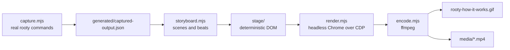

# Rooty explainer video pipeline

Regenerates the README hero GIF and the MP4 walkthroughs of how Rooty installs
and how an investigation is done.

The point of this directory is that the video is **reproducible**. Every command,
banner, file count, evidence observation, verdict, and ledger hash on screen is
captured from a real Rooty run rather than typed into a design tool, so the video
cannot quietly drift away from what the CLI actually does.

## Requirements

- Node.js 20 or newer (uses the built-in `WebSocket`, so no npm dependencies)
- `ffmpeg` with `libx264` and the `gif` encoder
- Chrome or Chromium. Set `CHROME_PATH` if it is not at `/usr/local/bin/google-chrome`,
  `/usr/bin/google-chrome`, `/usr/bin/chromium`, or `/usr/bin/chromium-browser`.
- The fonts `Inter` and `Cascadia Mono`. Missing fonts fall back to
  `DejaVu Sans` and `DejaVu Sans Mono`, which changes metrics slightly.

Chrome runs with `--no-sandbox` and a throwaway `--user-data-dir`, which is what
lets it work inside containers and CI.

## Regenerate everything

```console
node tools/video/generate.mjs
```

That runs all four stages and writes:

| Target | Output | Notes |
|---|---|---|
| `gif` | `rooty-how-it-works.gif` | README hero: silent, looping, 1200x675 at 20fps |
| `full` | `media/rooty-how-it-works.mp4` | Both acts, 1920x1080 at 30fps |
| `install` | `media/rooty-install.mp4` | Act 1 only |
| `investigation` | `media/rooty-investigation.mp4` | Act 2 only |
| `webm` | `media/rooty-how-it-works.webm` | VP9, not built by default |

Useful flags:

```console
node tools/video/generate.mjs --target gif            # one asset
node tools/video/generate.mjs --skip-capture          # reuse captured-output.json
node tools/video/generate.mjs --check --variant full  # 6 sample frames, no encode
node tools/video/generate.mjs --check --variant gif --sample 20
```

`--check` is the fast iteration loop: it renders evenly spaced sample frames into
`tools/video/generated/check/<variant>/` so layout can be reviewed without
waiting for a full render.

## How it works



### 1. `capture.mjs`

Creates a throwaway sandbox project in the system temp directory and runs the
real CLI against it: `install`, `install --docs`, an install that is *refused*
because a skill file was edited by hand, `doctor`, then `run ROOTY-101` against
`evals/mock-sources/confirmed-timeout.json`, `report`, `memory propose`,
`memory approve`, and `eval`. It records stdout, the resulting file tree, the
install manifest facts, the rendered report, and the full evidence hash chain
into `generated/captured-output.json`, then deletes the sandbox.

Absolute temp paths are rewritten to stable display paths (`~/work/checkout-api`,
`~/rooty-cases/INV-20260815-DEMO0001`) so frames stay readable and the captured
file does not change between runs. The captured file is committed, which is why
the storyboard and tests can run without invoking the CLI.

### 2. `storyboard.mjs`

Turns the capture into a timeline of scenes. Scenes are plain data: a heading, a
layout, and panels whose items carry a reveal time in milliseconds. Four variants
are available (`full`, `install`, `investigation`, `gif`); the `gif` variant picks
four beats, scales their timings tighter because a loop is watched more than once,
and trims trailing hold time.

`latestAnimationEnd()` computes when a scene's last animation finishes, mirroring
the timing the stage derives, and `trimTo()` refuses to shorten a scene past that
point. A variant can therefore never silently clip content.

### 3. `stage/`

An HTML page authored at a fixed 1920x1080. It exposes `window.rootySeek(frame)`
and renders **as a pure function of the frame index**: no CSS transitions or
animations exist anywhere, and every opacity, offset, width, and typed substring
is computed from `frame / fps`. That is what makes frame grabbing deterministic
regardless of how slowly the renderer runs.

To preview it in a normal browser, serve the directory and open
`index.html?frame=120`; the stage scales to fit any window.

Adding a panel type means adding one builder to the `PANELS` registry in
`stage.js`. The test suite parses that registry and fails if the storyboard
references a type the stage cannot draw.

### 4. `render.mjs`

Serves `stage/` and the generated timeline over loopback HTTP (avoiding
`file://` fetch restrictions), launches headless Chrome, and speaks the DevTools
Protocol over Node's built-in `WebSocket`. Per frame it calls `rootySeek(n)`,
waits two animation frames so the compositor has settled, and captures a PNG.
It asserts the layout viewport is exactly the design size before it starts.

### 5. `encode.mjs`

`ffmpeg` wrappers. MP4 is H.264 at CRF 20 with `+faststart`. The GIF uses a
single-invocation two-pass palette (`split` into `palettegen` then `paletteuse`
with `diff` stats and Bayer dithering). Encoding refuses to run on a frame
sequence with gaps, so a `--sample` render cannot be mistaken for a full one.

## Keeping it honest

`tests/video-tooling.test.js` runs with `npm test` and checks that:

- the captured Rooty version matches `package.json`;
- the captured install banner labels match a live `rooty install`;
- the captured owned-file count and doctor check names match live runs;
- the captured case, evidence, and hash chain match both the frozen snapshot and
  a live `runFrozenCase`;
- every scene is long enough for its own animations;
- every panel type used by the storyboard exists in the stage;
- the real observations, root cause, verdict, and doctor messages actually appear
  on screen;
- `tools/` and `media/` stay out of the published npm package.

When a test tells you to re-run `tools/video/capture.mjs`, the CLI output changed
and the video is stale. Re-capture, re-render, and commit the new assets.
